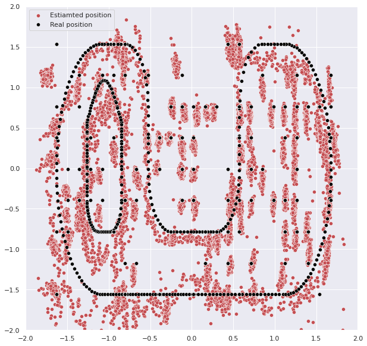
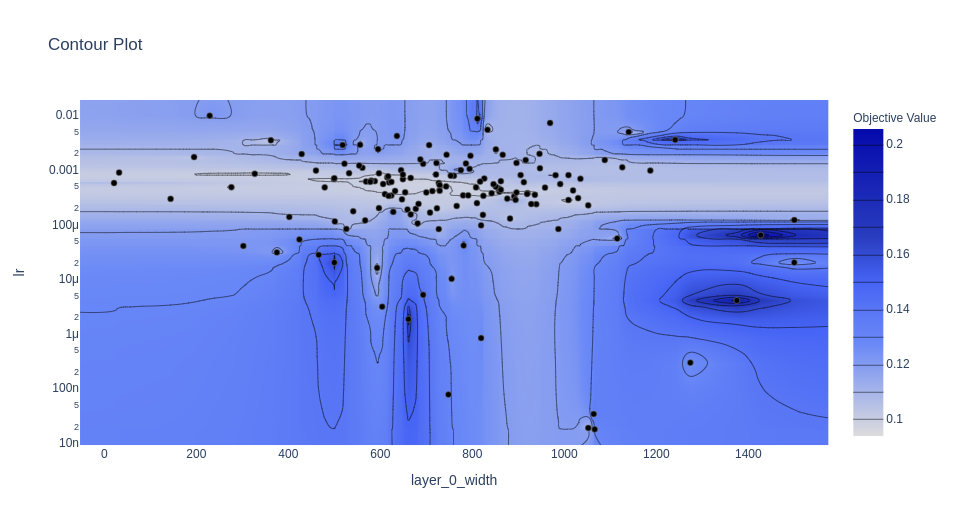
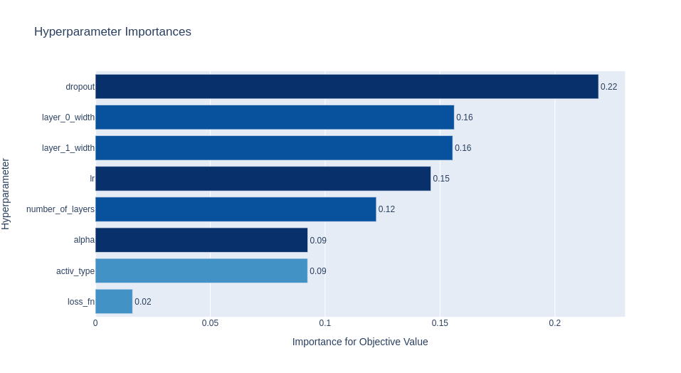
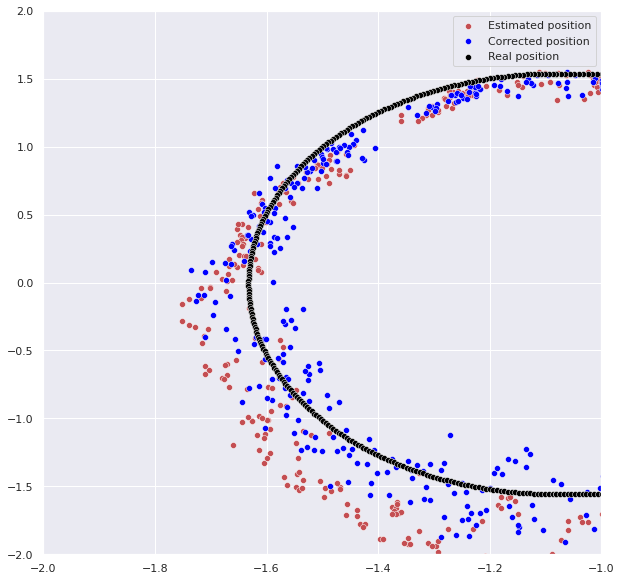

# LocCorr

Training data consists of pairs of estimated position and real position of some moving robots. Goal of the project was to test how well a feed forward neural net could correct the estimated position.

## Training data

## Hyperparameter search

## Effectiveness

